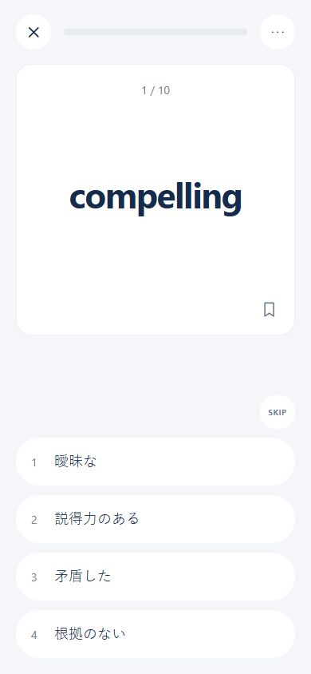
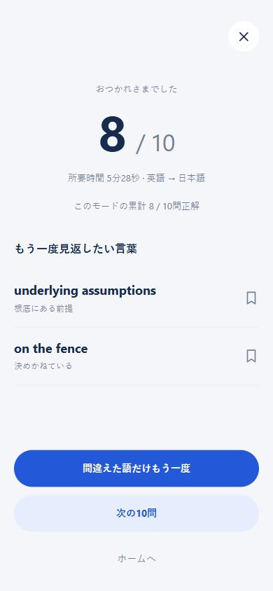
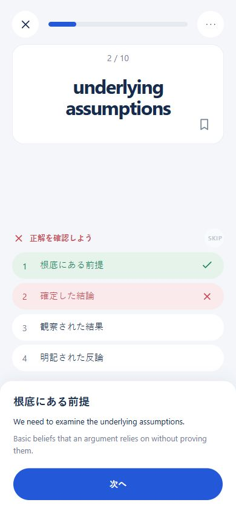
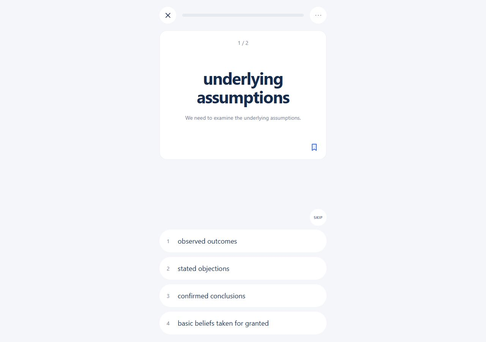
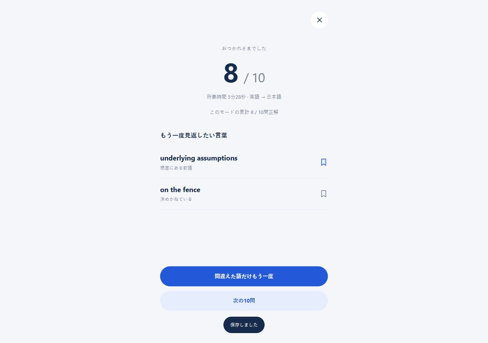

# クイズセッション 受入確認

2026-10-03。構文チェック、Node組み込みテスト9件、実ブラウザの390×844／1280×900で検証。

| 項目 | 評価 | 根拠 |
|---|---|---|
| セッション中はナビゲーションが一切表示されない | ○ | header/navを非表示、終了時に復元 |
| 1画面に問題が1つだけ表示される | ○ | 対象語要素1件 |
| 選択肢が画面下半分にあり、親指で届く | ○ | 390×844で先頭選択肢y=548、各60px、間隔12px |
| 正解時は待ち操作なしで次へ進む | ○ | 自動送りONで700ms後に1/10→2/10 |
| 誤答時は正解・意味・例文が表示される | ○ | 選択肢と解説シートを確認、SKIPも同じ扱い |
| 回答後に二重タップできない | ○ | 全選択肢disabled、重複キー入力の回答件数増加なし、コアテスト |
| 画面上に注釈・デモ文言が一つもない | ○ | セッションDOMの文言検査 |
| 色はすべてCSS変数経由で、ハードコードがない | ○ | セッションCSSの色指定はtoken宣言またはvar()のみ。既存画面は範囲外 |
| PCでキーボードだけで10問を完了できる | ○ | 英英10問、1〜4とEnter/Spaceで10/10。Esc中断も確認 |
| 結果から間違えた語だけもう一度が動く | ○ | 8/10結果の誤答・SKIP2語から1/2で開始 |
| 学習時間の自動計測 | 対象外 | 結果の経過時間を既存の時間集計へ加算しない |

回答ログの再読み込み、モードの記憶、次セットへのモード反映、保存状態切替、範囲が少ない場合のn/N、保存失敗時の回答保留を確認。0件は出題抽出のテストと完了画面の分岐を確認。

Android等の短い振動は対応API経由で実装。実機の振動感触は未検証。ブラウザ保存は端末・ブラウザ・オリジンごとで、クラウド同期は今回の範囲外。

## 390px

## 1280px

