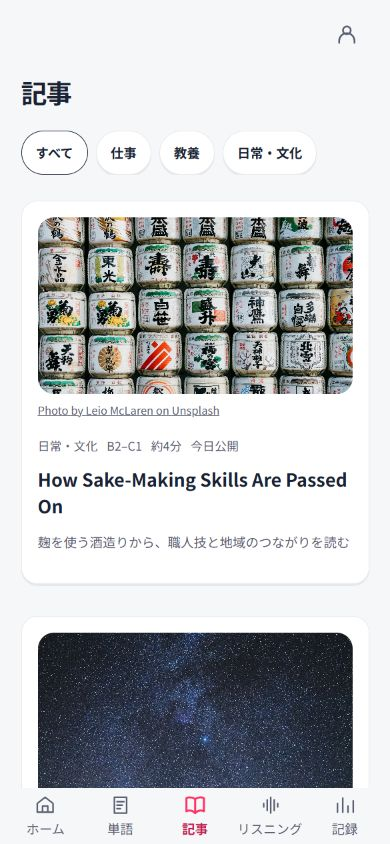
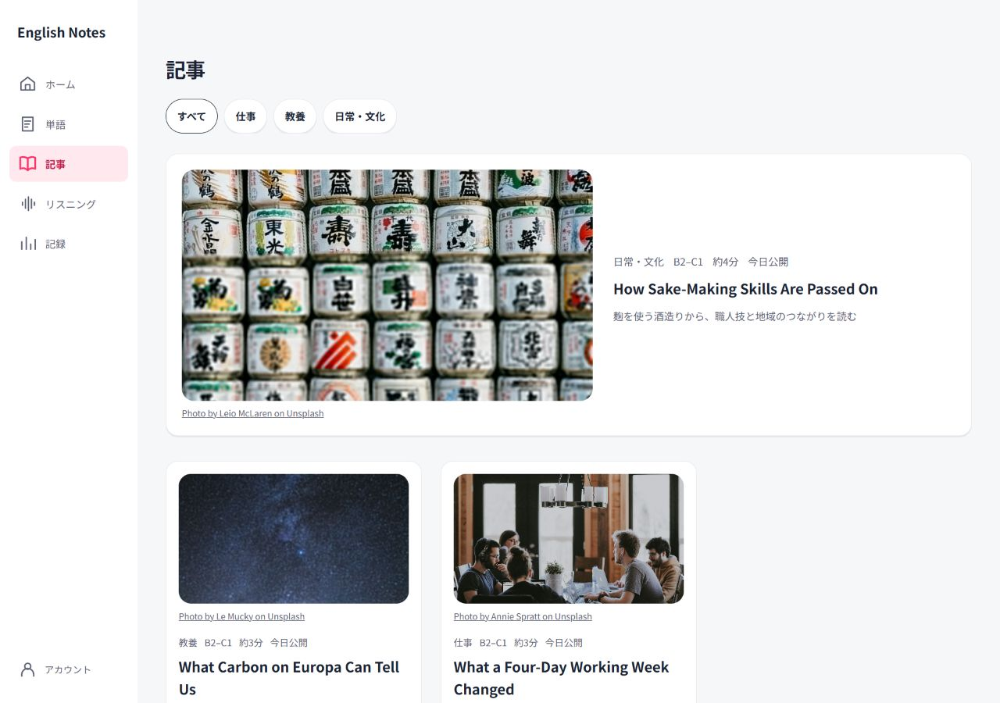
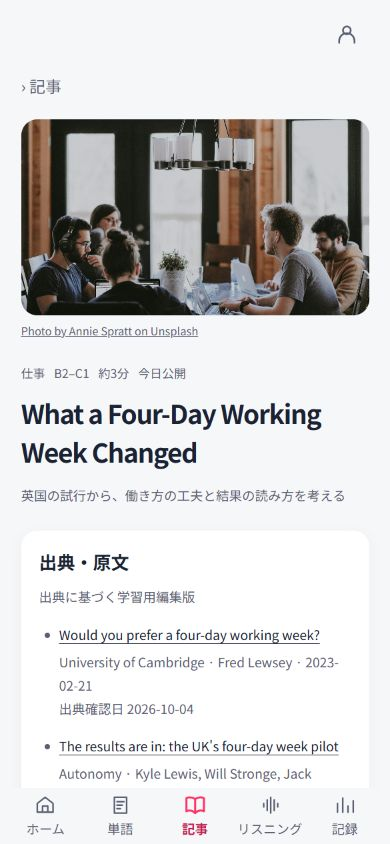
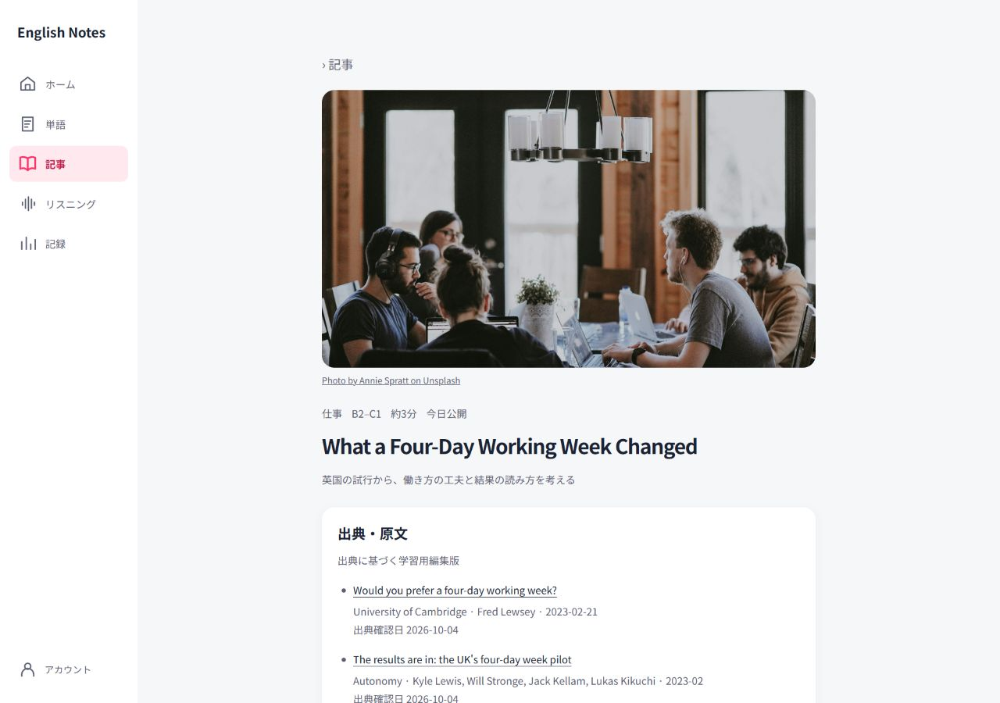
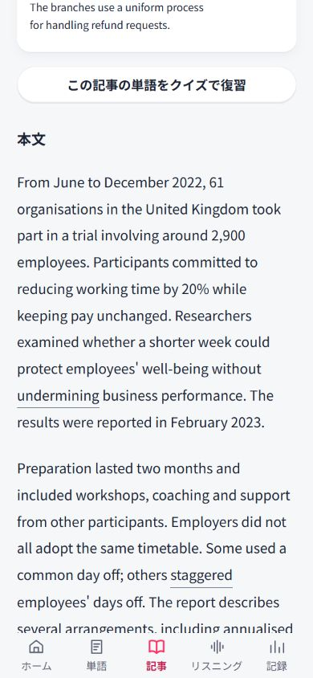
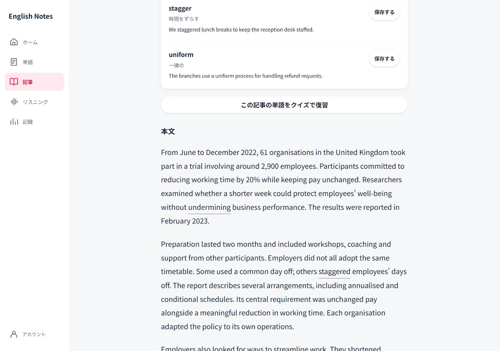
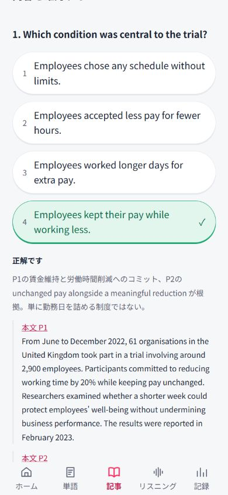
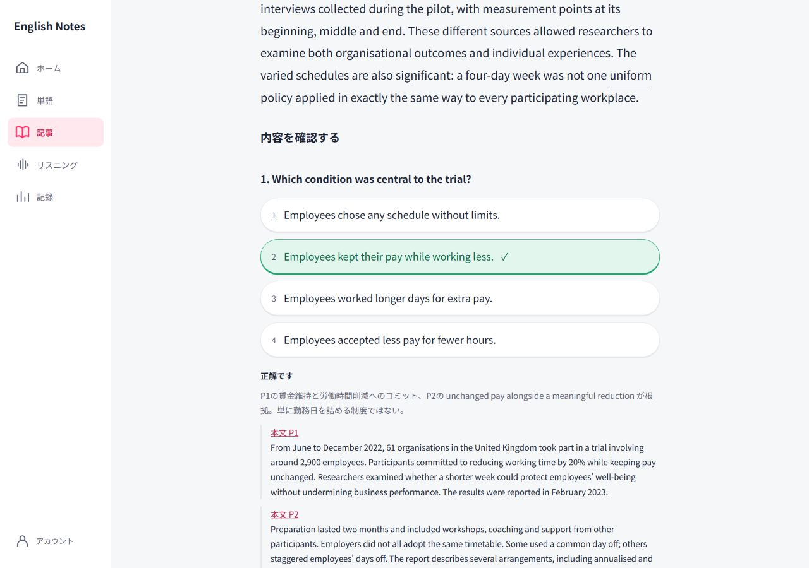
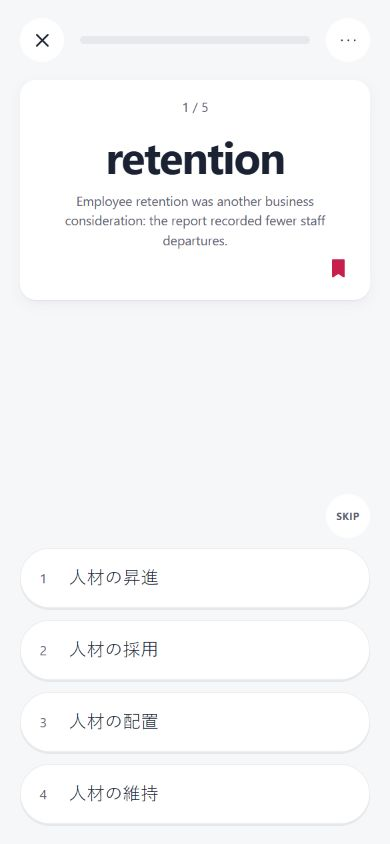
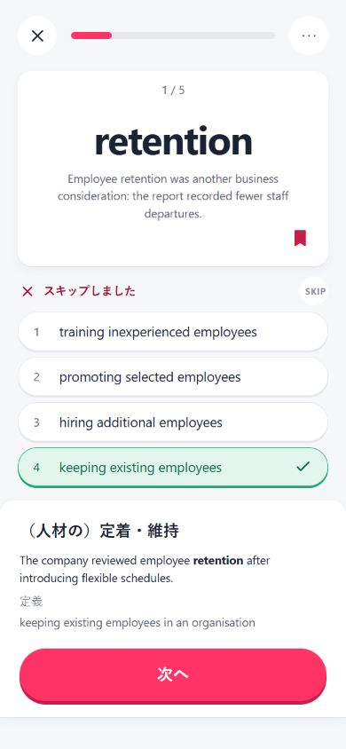

# 第5段階：記事の実装結果

仕上げ後の最新画面・確認結果は [stage5-polish-report.md](stage5-polish-report.md) を参照。

2026-10-04。記事3本・各5語・理解問題各3問を実装。第6段階は設計再承認待ちで、認証・SQL・同期は未実装。

## 教材と追加手順

仕事359語、教養338語、日常・文化363語。仕事の推論正解を指定文に変更し、選択肢の長さも検証済み。retentionは「（人材の）定着・維持」。記事由来のクイズは両モードで本文の該当文を表示する。

教材の正はmaterials/articlesとmaterials/vocabularyのJSON。既存C1①は下書きのまま使用し、残り90語は作成していない。旧JS教材は旧保存語・初期化の互換用。新しい教材はJSONを追加・編集後、`node scripts/validate-materials.cjs --write`で検証・索引更新し、Gitへ反映する。コードの編集は不要。公開日時を過ぎたものだけ表示する。検証エラー時は取り込まず、JSONのSHA-256が索引と異なる場合も取り込まない。公開JSONの未来公開制御は秘匿ではない。

すべての4択は固定選択肢IDで採点し、出題ごとにランダム化する。1〜4キーは表示順。語彙回答は既存ログに追記、内容理解はenglish-notes.article.answers.v1に固定IDとUUIDを追記。内容理解の回答は語彙の習熟度には算入しない。読了と意見の下書きも専用キーに保存し、既存データを削除・変更しない。

コロケーションは各語3件、すべて未確認。今回は表示しない。C1①への追加もしない。

## 出典と写真

- 仕事：University of Cambridge / Fred Lewsey / 2023-02-21、Autonomy / Kyle Lewisほか / 2023-02。[Cambridge](https://www.cam.ac.uk/stories/fourdayweek)、[Autonomy](https://autonomy.work/portfolio/uk4dwpilotresults/)。
- 教養：[NASA](https://science.nasa.gov/missions/webb/nasas-webb-finds-carbon-source-on-surface-of-jupiters-moon-europa/)、ESAおよび観測論文。観測と推定を区別し、生命発見とは述べない。本文段落ごとの出典対応はJSONに保持。
- 日常・文化：[政府広報](https://www.gov-online.go.jp/hlj/en/march_2025/march_2025-00.html)、UNESCO、ユネスコ日本政府代表部。UNESCOの2024年は登録年として表示し、元ページの公開日とは扱わない。

写真はAnnie Spratt（仕事）、Le Mucky（教養）、Leio McLaren（日常・文化）のUnsplash素材。[Unsplash License](https://unsplash.com/license)に基づき無料で利用・加工・配布。無加工販売・競合素材サービス向け収集は不可。各画面に撮影者・Unsplashリンクを表示。写真は題材のイメージであり当該試行・エウロパ・登録対象そのものの記録写真ではない。

## 検証と受入評価

教材4件：0エラー・0警告。自動テスト30件通過。全24通りの選択肢順×両モードの採点、ID保存、二重回答防止、改変JSONの拒否、未来公開の非表示を検証。実画面では語彙保存・本文の複数語保存・設問根拠・下書きの再表示・読了チェック・両モードの本文該当文を確認。

| 項目 | 評価・確認結果 |
|---|---|
| 共通ルールと禁止文言の削除 | ○ docs/design-rules.mdを維持、記事の禁止3文言なし |
| 3本が実在の出典に基づく | ○ 出典ブロック・原文リンク・確認日を表示 |
| 写真の利用条件・クレジット | ○ 3枚ともUnsplash License、撮影者リンクあり |
| 一覧1080px・本文680px | ○ CSS最大幅、390/1280で横はみ出しなし |
| 語彙→本文→設問→意見→読了 | ○ DOM順と実画面を確認 |
| 本文の語・表現を保存 | ○ retentionと選択したUnited Kingdomが単語一覧に反映 |
| 重要語彙のクイズ | ○ 5問で開始、英日・英英とも本文該当文あり、セッション中ナビ非表示 |
| 読了の一覧反映 | ○ 読了ボタン後に一覧へ戻りチェック表示 |
| 禁止注釈・英字小見出し・スローガンなし | ○ 必須の出典編集版表示・保存結果以外のプロトタイプ注釈なし |

390×844の誤答クイズはカード高さ220px、次へボタン下端約790pxで画面内。PC一覧は最大1080px、1280pxの実幅は左ナビと余白を引いた範囲。

## 画面

| 390px | 1280px |
|---|---|
|  |  |
|  |  |
|  |  |
|  |  |

