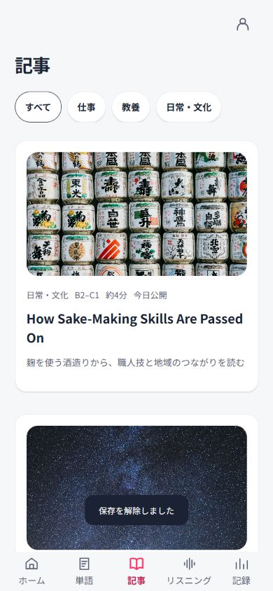
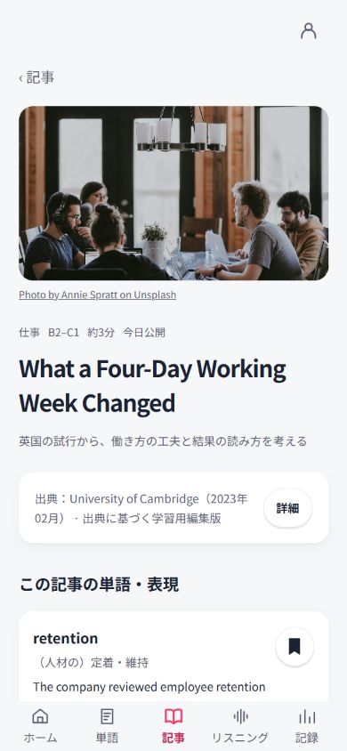
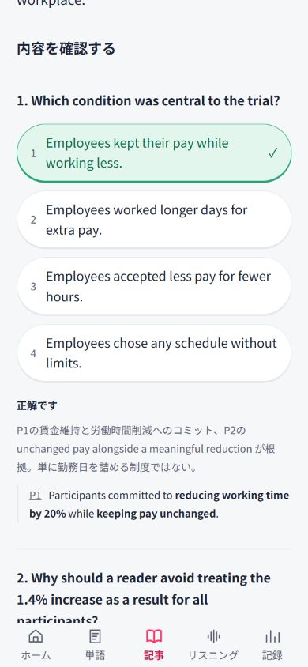

# 記事の仕上げと同期SQLの準備

2026-10-04。記事の仕上げが完了した後、承認された簡略同期設計に合わせてSQL2本と手順書を作成。実Supabaseへの適用・接続情報の設定・フロント同期実装は行っていない。

## 記事の確認結果

| 修正 | 結果 |
|---|---|
| 根拠は1〜2文・重要語句は太字・小さい段落番号 | ○ 9問のJSONに原文と一致する短い根拠と強調語句を追加、検証対象に含めた |
| 出典の要約と開閉式の詳細 | ○ 媒体・元記事公開年月・学習用編集版を要約に表示、著者・タイトル・原文リンク・確認日は詳細内 |
| 写真クレジットは記事ページだけ | ○ 一覧のクレジットなし、記事ページの写真下に保持 |
| 戻る表示・保存アイコン・クイズ導線文言 | ○ ‹ 記事、線/塗りつぶしのしおり、単語を確認する |
| 共通デザインルール | ○ 同じ色・質感トークンを維持、装飾や主要ボタンを追加しない |

Unsplashの通常ライセンスでは帰属表示は必須ではなく推奨。APIを利用した配信ではなく、許可された無料素材をローカル資産として使用している。記事ページでは撮影者とUnsplashへのリンクを残す。[公式ライセンス](https://unsplash.com/license)

教材検証は4教材・0エラー・0警告。30テスト成功。画面で出典詳細の開閉、しおりの保存/解除、短い根拠と太字、横はみ出しなしを確認。

## 390pxの画面

## 同期SQLの確認結果

- 4可変表（saved_words/preferences/article_states/opinion_drafts）は、updated_atが以前/同値なら行全体を更新しない。
- 6学習表と私有許可表にRLSとDB側受信日時。一般利用者は許可表やHookを呼べない。
- Googleと許可メールの登録HookはSECURITY INVOKER、複数メールに対応。
- unit_best_scores、専用同期RPC、端末連番、時計補正、日次自動全件取得は追加しない。
- 重なり幅はconfig/sync-policy.jsonの1か所。手動再同期は次の同期実装時にアカウントメニューへ追加する。
- 隔離PostgreSQLの43チェックが成功し、QAも独立再実行で成功。実Supabase Auth/API、2端末同期は未検証。

[更新した同期設計](stage6-sync-design.md)、[ユーザー実行手順](stage6-supabase-setup.md)。SQLはsupabase/migrationsのCLI生成番号付き2本で管理。キー・実メールは含まない。
